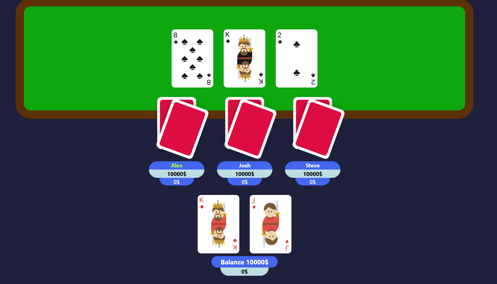
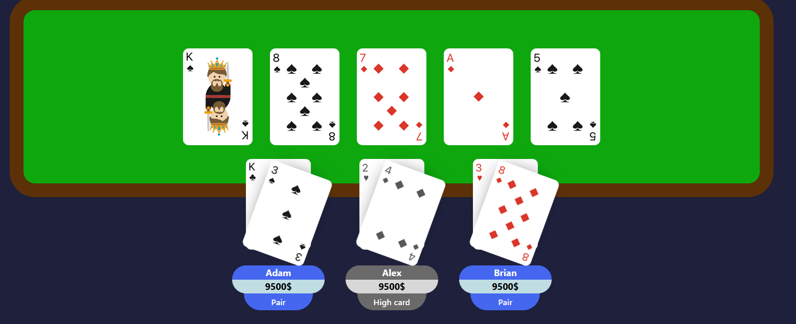

# PokerApp
Online poker game application

---
# Server code
https://github.com/WiktorGruszczynski/PokerAppBackend

# Client code
https://github.com/WiktorGruszczynski/PokerAppFrontend

---
## 📸 Gameplay Preview

### 🟢 Game Start  
  
Beginning of the game.

---

### 🃏 Showdown  
  
All players have revealed their hands.

---

### 🎮 Player Controls  
  
A clean and intuitive UI with all the essential actions: **Bet**, **Call**, **Check**, and **Fold**.

---