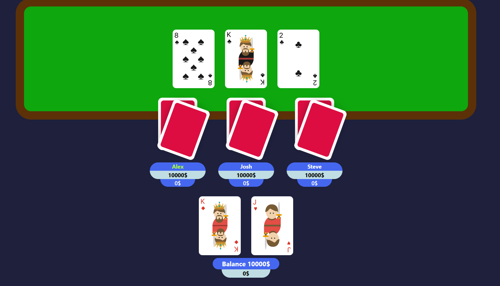
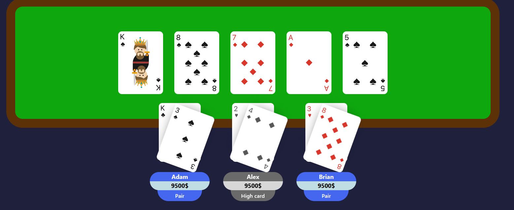

# PokerApp 🃏
> Online poker game application built with modern stack.

---
## 📸 Gameplay Preview

### Game Start  
  
Beginning of the game.

---

### Showdown  
  
All players have revealed their hands.

---

### Player Controls  
  
A clean and intuitive UI with all the essential actions: **Bet**, **Call**, **Check**, and **Fold**.

---